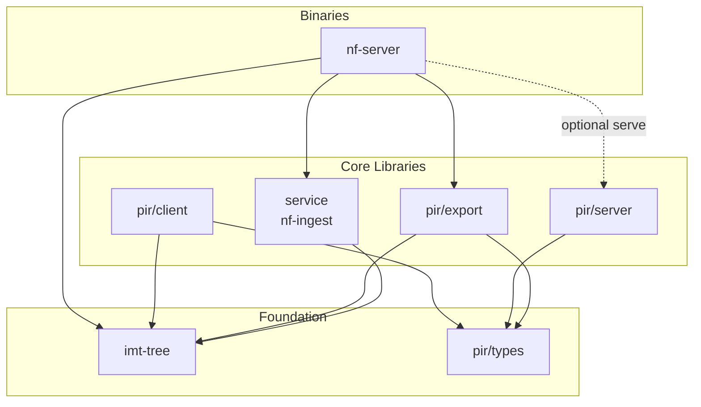

# Vote Nullifier PIR

Private Information Retrieval (PIR) system for Zcash nullifier non-membership proofs. Allows a client to prove that a nullifier does **not** exist in the on-chain nullifier set without revealing *which* nullifier it is querying — a key building block for shielded voting.

- [ZIP Specification (PR)](https://github.com/zcash/zips/pull/1198)
- [PIR Tree Specification](docs/pir-tree-spec.md)
- [PIR Parameter Selection](docs/params.md)

## Architecture

The system is organised as a Cargo workspace with eight crates split across three layers:



### Crate Descriptions

| Crate | Path | Description |
|-------|------|-------------|
| **imt-tree** | `imt-tree/` | Indexed Merkle Tree library. Poseidon hashing, punctured-range exclusion proofs (K=2), and tree-building primitives for circuit compatibility. |
| **pir-types** | `pir/types/` | Lightweight shared types (`YpirScenario`, `RootInfo`, `HealthInfo`) serialised over HTTP between server and client. Also contains YPIR wire-format helpers. |
| **pir-export** | `pir/export/` | Builds the depth-25 PIR tree from punctured-range leaves (K=2), persists `nullifiers.tree` checkpoints, and exports three binary tier files (tier0, tier1, tier2) consumed by the server and client. |
| **pir-server** | `pir/server/` | YPIR server-side logic: loads tier data, processes encrypted PIR queries, and returns encrypted responses. |
| **pir-client** | `pir/client/` | YPIR client-side logic: generates encrypted queries, decodes responses, and assembles circuit-ready `ImtProofData`. Provides an async `PirClient` API and a local in-process mode. |
| **nf-ingest** | `nf-ingest/` | Shared library for nullifier sync from lightwalletd, flat-file storage (`nullifiers.bin`), and configuration. |
| **nf-server** | `nf-server/` | Unified CLI: `sync` (nullifiers from lightwalletd → `nullifiers.tree` → tier files) and `serve` (PIR HTTP server, feature-gated). |
| **pir-test** | `pir/test/` | End-to-end test harness with `small`, `local`, `server`, and `bench` modes. |

## Pipeline

The system operates as a resumable pipeline:

```
nf-server sync (nullifiers → nullifiers.tree → tier files) ──> serve ──> client query
```

1. **`nf-server sync`** — Streams Orchard nullifiers into `nullifiers.bin` (with checkpoint/index), builds a versioned **`nullifiers.tree`** checkpoint, then writes `tier0.bin`, `tier1.bin`, `tier2.bin`, and `pir_root.json` (by default all under `--pir-data-dir`). Reruns skip completed stages.
2. **`nf-server serve`** — Starts an HTTP server that serves tier data and answers YPIR queries. The client downloads tier 0 in plaintext, then privately retrieves tier 1 and tier 2 rows via encrypted PIR queries.

## Build & Run

Requires Rust (stable for most crates; nightly for `pir-server` with AVX-512 support).

```bash
# Build everything
cargo build --release

# Or use the Makefile for the standard pipeline:
make build          # Build nf-server binary
make sync           # Ingest + tree + tiers (resumable)
make serve          # Start PIR HTTP server on port 3000

# Run tests
make test           # Unit tests for imt-tree and nf-ingest
cargo test -p pir-export  # PIR export round-trip tests
```

### Configuration

Override via environment variables or Make arguments:

| Variable | Default | Description |
|----------|---------|-------------|
| `PIR_DATA_DIR` | `pir-data` | On-disk root: `nullifiers.bin`, checkpoint, index, `nullifiers.tree`, and tier files (`SVOTE_PIR_DATA_DIR` for `nf-server`) |
| `LWD_URL` | `https://zec.rocks:443` | Lightwalletd gRPC endpoint |
| `PORT` | `3000` | HTTP server port |
| `SYNC_HEIGHT` | chain tip | Sync up to this block height (must be a multiple of 10) |
| `SVOTE_PIR_SYNC_RESET` | unset | Set to `1` to wipe nullifiers + tree + tiers before `sync` |
| `SVOTE_PIR_VOTING_CONFIG_URL` | (see `nf-server sync --help`) | Empty string skips voting-config fetch during `sync` |

## Deployment

See [docs/runbooks/server-setup.md](docs/runbooks/server-setup.md) for production deployment instructions, hardware sizing, install, and systemd configuration. For the CI/CD pipeline and GitHub Actions workflow details, see [docs/runbooks/ci-setup.md](docs/runbooks/ci-setup.md).

## Storage Format

All data is stored as flat binary files under one directory (by default `./pir-data`, overridable via `PIR_DATA_DIR` / `SVOTE_PIR_DATA_DIR`):

- `nullifiers.bin` — Append-only raw 32-byte nullifier blobs
- `nullifiers.checkpoint` — 16-byte crash-recovery marker (height + byte offset, both LE u64)
- `nullifiers.index` — Height-to-offset index for subset loading
- `nullifiers.tree` — Versioned PIR Merkle checkpoint (magic `SVOTEPT1`; see `pir-export`)
- `tier0.bin`, `tier1.bin`, `tier2.bin`, `pir_root.json` — PIR tier payload and root metadata

## PIR Write Ups

- [YPIR Security](https://x.com/akhtariev/status/2030768109196316712)
- [PIR Applications in Zcash](https://www.akhtariev.ca/blog/sync-tax)
- [Motivation for Compression/Packing](https://x.com/akhtariev/status/2030449201335705640)
- [GPU Optimizations](https://www.akhtariev.ca/blog/pir-gpu-acceleration)
