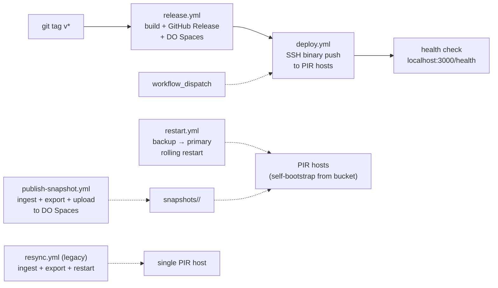

# Deploy setup for nf-server

This guide covers two deployment paths:

- **[Binary setup](#binary-setup-operators)** -- Download a pre-built binary and run the service. No Rust toolchain or git clone required.
- **[Source setup](#source-setup-developers)** -- Build from source with CI/CD-driven deployment.

---

## Hardware requirements

| Resource | Minimum | Recommended | Notes |
|----------|---------|-------------|-------|
| **CPU** | x86-64 (any) | x86-64 with AVX-512 | AVX-512 gives ~2x query throughput. Intel Ice Lake / Sapphire Rapids or newer. AMD Zen 4+. |
| **RAM** | 16 GB | 32 GB | The server loads ~6 GB of tier data and builds YPIR internal structures. Peak usage during initialization is roughly 2x the tier data size. |
| **Disk** | 20 GB free | 40 GB free | Nullifier data (~1.6 GB), PIR tier files (~6 GB), plus headroom for ingestion and re-export. |
| **OS** | Linux (x86-64) | Ubuntu 22.04+ / Debian 12+ | macOS (arm64/amd64) binaries are also published but not recommended for production serving. |
| **Network** | Outbound HTTPS | Static IP or DNS A record | Needs outbound access to a lightwalletd gRPC endpoint for ingestion. Inbound access on the serve port for clients. |

### AVX-512 note

The `serve` feature works on any x86-64 CPU. AVX-512 is an optional optimization that approximately halves PIR query latency (tier 1: ~0.5 s, tier 2: ~1.6 s per query). The pre-built `linux-amd64` release binary includes AVX-512 support; on CPUs without it the binary still runs but falls back to baseline SIMD.

---

## Binary setup (operators)

This path is for operators who want to run `nf-server` without cloning the repository or installing the Rust toolchain.

### 1. Download the binary

Grab the latest release from GitHub:

```bash
# Pick the asset for your platform
PLATFORM="linux-amd64"   # or: linux-arm64, darwin-amd64, darwin-arm64
VERSION=$(curl -s https://api.github.com/repos/valargroup/vote-nullifier-pir/releases/latest | grep tag_name | cut -d'"' -f4)

sudo mkdir -p /opt/nf-ingest
cd /opt/nf-ingest

# Download the binary and systemd unit
curl -fLO "https://github.com/valargroup/vote-nullifier-pir/releases/download/${VERSION}/nf-server-${PLATFORM}"
curl -fLO "https://github.com/valargroup/vote-nullifier-pir/releases/download/${VERSION}/nullifier-query-server.service"

sudo mv "nf-server-${PLATFORM}" nf-server
sudo chmod +x nf-server
```

### 2. Configure the snapshot bootstrap

Tell `nf-server` where to find the published voting-config and the
pre-computed snapshot bucket. Both have production defaults baked into
the binary; pinning them here keeps the deployment self-documenting and
lets you redirect to a staging mirror without rebuilding.

```bash
sudo tee /etc/default/nf-server <<'EOF'
SVOTE_VOTING_CONFIG_URL=https://valargroup.github.io/token-holder-voting-config/voting-config.json
SVOTE_PRECOMPUTED_BASE_URL=https://vote.fra1.digitaloceanspaces.com
EOF
```

That is the entire bootstrap step. On startup, `nf-server` reads
`voting-config.snapshot_height` and downloads
`<bucket>/snapshots/<height>/{manifest.json,tier*.bin,pir_root.json}`,
verifies sha256 against the manifest, and atomically swaps into
`/opt/nf-ingest/pir-data/`. There is no manual ingest, no manual
export, and no separate cron-driven re-sync — the next bump is just a
config PR plus a `systemctl restart` (see [the runbook][runbook]).

> The legacy first-boot flow (`curl` the raw `nullifiers.{bin,checkpoint,tree}`,
> run `nf-server ingest`, then `nf-server export`) still works on
> offline / dev machines: set `SVOTE_VOTING_CONFIG_URL=` (empty string)
> and the binary will skip the bootstrap and serve whatever is on disk.

[runbook]: https://valargroup.github.io/shielded-vote-book/operations/snapshot-bumps.html

### 3. Install the systemd service

```bash
sudo cp /opt/nf-ingest/nullifier-query-server.service /etc/systemd/system/
sudo systemctl daemon-reload
sudo systemctl enable nullifier-query-server
sudo systemctl start nullifier-query-server
```

Verify the service is running and serving the expected snapshot:

```bash
sudo systemctl status nullifier-query-server
curl http://localhost:3000/health
curl -s http://localhost:3000/root | jq .
curl -s http://localhost:3000/metrics | grep -E 'nf_snapshot_(served|expected)_height'
```

---

## Caddy reverse proxy with automatic TLS

[Caddy](https://caddyserver.com/) provides automatic HTTPS certificate provisioning via Let's Encrypt. This section sets up Caddy in front of `nf-server` so clients connect over TLS.

### Prerequisites

- A domain name with a DNS A record pointing to your server's public IP.
- Ports 80 and 443 open in your firewall (Caddy needs both for ACME HTTP-01 challenge).

### Install Caddy

```bash
# Debian / Ubuntu
sudo apt install -y debian-keyring debian-archive-keyring apt-transport-https
curl -1sLf 'https://dl.cloudsmith.io/public/caddy/stable/gpg.key' | sudo gpg --dearmor -o /usr/share/keyrings/caddy-stable-archive-keyring.gpg
curl -1sLf 'https://dl.cloudsmith.io/public/caddy/stable/debian.deb.txt' | sudo tee /etc/apt/sources.list.d/caddy-stable.list
sudo apt update
sudo apt install caddy
```

### Configure Caddy

Replace `pir.example.com` with your actual domain:

```bash
cat <<'EOF' | sudo tee /etc/caddy/Caddyfile
pir.example.com {
    reverse_proxy localhost:3000
}
EOF
```

### Start Caddy

```bash
sudo systemctl enable caddy
sudo systemctl restart caddy
```

Caddy will automatically obtain and renew a TLS certificate. Verify with:

```bash
curl https://pir.example.com/health
```

---

## Snapshot-stale alerting

`nf-server` includes an in-process watchdog that fires a Sentry error
event when the host serves a snapshot older than the canonical
voting-config height for longer than a configurable threshold (default
30 minutes). Sentry's Slack integration then routes the event to the
on-call channel.

### What gets observed

The watchdog ticks every 60 seconds and compares two Prometheus
gauges on the same host:

- `nf_snapshot_served_height` -- height of the snapshot currently
  loaded into the PIR tree (set during `load_serving_state`).
- `nf_snapshot_expected_height` -- height the published voting-config
  declares as canonical (set during the startup bootstrap).

A host is **stale** iff `expected_height > 0 && served_height < expected_height`.
Both partial staleness (e.g. `served=3312880, expected=3312890`) and
complete staleness (e.g. `served=0, expected=3312890`, meaning no
local snapshot at all) trigger the same alert -- the latter is just
the worst case.

The continuous staleness duration is exposed as
`nf_snapshot_stale_seconds`, which dashboards can graph and which
goes back to 0 the moment the host catches up.

### Configuration

| Env var | CLI flag | Default | Effect |
|---------|----------|---------|--------|
| `SVOTE_STALE_THRESHOLD_SECS` | `--stale-threshold-secs` | `1800` (30 min) | How long staleness must persist before Sentry fires. `0` disables the watchdog entirely. |
| `SVOTE_WATCHDOG_TICK_SECS` | `--watchdog-tick-secs` | `60` | Polling cadence. Capped below the threshold at runtime. |

Both have production defaults baked in -- there is nothing to add to
`/etc/default/nf-server` unless you want to override.

### Sentry-side alert rule (one-time setup)

The Sentry events are tagged for filtering:

| Tag | Value |
|-----|-------|
| `alert` | `snapshot_stale` |
| `served_height` | the current served height as a string |
| `expected_height` | the canonical height as a string |
| `gap_blocks` | `expected - served` |
| `stale_seconds` | how long this host has been stale |

Configure the alert in Sentry (one rule per project):

1. **Settings → Integrations → Slack** -- install the Sentry Slack app
   into your workspace if not already present, then **Add Workspace**
   in the project. Pick a channel like `#oncall-pir`.
2. **Alerts → Create Alert Rule** with:
   - Environment: `production`
   - When: *An issue is created*
   - If: *The issue's tags match `alert` equals `snapshot_stale`*
   - Then: *Send a Slack notification to `#oncall-pir`*
3. Save the rule. Optionally add a *resolved* notification using
   `level: info` + `message contains "snapshot height converged"` --
   the watchdog emits an info event when the gap closes after an
   alert.

### Verification

Stand up a verification fire by temporarily setting a tiny threshold
and bumping `voting-config.snapshot_height` to a value that has no
published snapshot (or tail one host's `/metrics` while you do it):

```bash
ssh root@<host> 'echo SVOTE_STALE_THRESHOLD_SECS=120 >> /etc/default/nf-server && systemctl restart nullifier-query-server'
# Wait ~3 minutes, then check the channel.
ssh root@<host> 'sed -i /SVOTE_STALE_THRESHOLD_SECS/d /etc/default/nf-server && systemctl restart nullifier-query-server'
```

A real fire shows up in Sentry as an issue with the
`alert:snapshot_stale` tag and an Error level. If you do not see the
Slack message but the issue is in Sentry, the wiring problem is on
the Sentry → Slack side, not in `nf-server`.

---

## Source setup (developers)

This path is for contributors and operators who want to build from source with CI/CD-driven deployment.

### Moving cached data to the deploy directory

The service uses flat binary files for nullifier storage. To move them into the deploy directory (default `/opt/nf-ingest`):

```bash
sudo mkdir -p /opt/nf-ingest

# Stop the service first if it is running
sudo systemctl stop nullifier-query-server || true

# Move data files
sudo mv /path/to/nullifiers.bin        /opt/nf-ingest/
sudo mv /path/to/nullifiers.checkpoint /opt/nf-ingest/
sudo mv /path/to/nullifiers.tree       /opt/nf-ingest/

# Ensure the deploy user can write (if deploy runs as a different user)
# sudo chown -R DEPLOY_USER:DEPLOY_USER /opt/nf-ingest
```

The unit file in `docs/nullifier-query-server.service` uses `/opt/nf-ingest` as the data directory by default.

### GitHub repository secrets

The CI workflows use these repository secrets (**Settings > Secrets and variables > Actions**):

| Secret | Used by | Description |
|--------|---------|-------------|
| `PIR_PRIMARY_HOST` | `deploy.yml`, `restart.yml` | Hostname or IP of the PIR primary server. |
| `PIR_BACKUP_HOST` | `deploy.yml`, `restart.yml`, `publish-snapshot.yml` | Hostname or IP of the PIR backup server. |
| `DEPLOY_HOST` | `resync.yml` | Hostname or IP of the resync target (typically the primary). |
| `DEPLOY_USER` | all | SSH username on the remote hosts. |
| `SSH_KEY` | all | SSH private key for authentication. |
| `NF_SENTRY_DSN` | `deploy.yml` | Sentry DSN written to `/opt/nf-ingest/.env` on deploy. |
| `DO_ACCESS_KEY` | `release.yml` | DigitalOcean Spaces access key (optional; for artifact mirroring). |
| `DO_SECRET_KEY` | `release.yml` | DigitalOcean Spaces secret key (optional). |

### One-time setup on the remote host

**Directory and binaries**

- Create the deploy directory. Default in the workflow is `DEPLOY_PATH: /opt/nf-ingest`.
- Ensure the SSH user can write to that directory.
- Either bootstrap the nullifier data (`make bootstrap`) or run an initial ingest.

**Query server (PIR HTTP API)**

The `nf-server serve` subcommand starts the PIR HTTP server. It needs:

- **PIR data**: Exported tier files in `pir-data/`. Either populated automatically by the startup self-bootstrap (default) or pre-staged manually via `nf-server export`.
- **Bootstrap config**: `SVOTE_VOTING_CONFIG_URL` and `SVOTE_PRECOMPUTED_BASE_URL` env vars (compiled-in defaults point at production). Set the former to an empty string to disable the bootstrap entirely.
- **Nullifier data** (only on the publisher host that runs `publish-snapshot.yml`): `nullifiers.bin` and `nullifiers.checkpoint` in `--data-dir`. PIR-only replicas no longer need these.
- **Port**: Configurable via `--port` (default 3000).

A systemd unit file is provided at `docs/nullifier-query-server.service`. Copy to `/etc/systemd/system/`:

```bash
sudo cp docs/nullifier-query-server.service /etc/systemd/system/
sudo systemctl daemon-reload
sudo systemctl enable nullifier-query-server
sudo systemctl start nullifier-query-server
```

**Bumping to a new snapshot**

Edit `voting-config.json`'s `snapshot_height`, run
[`publish-snapshot.yml`](https://github.com/valargroup/vote-nullifier-pir/actions/workflows/publish-snapshot.yml)
for the new height, then trigger
[`restart.yml`](https://github.com/valargroup/vote-nullifier-pir/actions/workflows/restart.yml)
to roll the fleet (backup-then-primary, with per-host
`served_height == expected_height` verification). See the
[in-repo restart runbook](runbooks/restart-pir-fleet.md) for the
restart step in detail, or the [end-to-end operator runbook][runbook]
for the full bump procedure. The old per-host `resync.yml` /
`nf-resync.timer` flow is no longer required and was removed from
`vote-infrastructure/cloud-init/pir.yaml`.

### Changing deploy path or restart command

- **Deploy path**: Edit the `env.DEPLOY_PATH` in `.github/workflows/deploy.yml` (default `/opt/nf-ingest`).
- **Restart command**: Edit the "Install and restart" step in that workflow if you use a different service name.

### Manual runs

`deploy.yml`, `restart.yml`, `publish-snapshot.yml`, and `resync.yml`
all support `workflow_dispatch`, so you can trigger them from
**Actions > Run workflow** without pushing to `main`.

### Test locally

From the workspace root:

```bash
# Bootstrap nullifier data (first run only)
make bootstrap

# Or ingest from scratch
make ingest

# Export PIR tier files
make export-nf

# Start the server
make serve
```

Then check `http://localhost:3000/health` and `http://localhost:3000/root`.

---

## CI/CD workflows



| Workflow | Trigger | What it does |
|----------|---------|-------------|
| [`release.yml`](https://github.com/valargroup/vote-nullifier-pir/blob/main/.github/workflows/release.yml) | `v*` tag push | Builds `nf-server` for linux/darwin x amd64/arm64, creates a GitHub Release with binaries + systemd unit, mirrors to DO Spaces, then automatically calls `deploy.yml`. |
| [`deploy.yml`](https://github.com/valargroup/vote-nullifier-pir/blob/main/.github/workflows/deploy.yml) | Called by `release.yml`, or manual `workflow_dispatch` | Downloads binary from GitHub Releases, SCPs to PIR hosts, writes `.env`, copies systemd unit, restarts service, runs health check. Supports deploying to primary, backup, or both. Hosts run **in parallel** in the matrix. |
| [`publish-snapshot.yml`](https://github.com/valargroup/vote-nullifier-pir/blob/main/.github/workflows/publish-snapshot.yml) | Manual `workflow_dispatch` (with optional `height` input) | Runs ingest + export on `PIR_BACKUP_HOST`, builds `manifest.json`, uploads `s3://vote/snapshots/<height>/{tier*.bin,pir_root.json,manifest.json}` to DO Spaces, round-trip-verifies. Replicas pick up the new snapshot via the startup self-bootstrap on next restart. |
| [`restart.yml`](https://github.com/valargroup/vote-nullifier-pir/blob/main/.github/workflows/restart.yml) | Manual `workflow_dispatch` (`targets` = `both` / `primary` / `backup`) | Rolling restart of the PIR fleet. Restarts backup first, waits for `/health` and `nf_snapshot_served_height == nf_snapshot_expected_height`, then restarts primary. Primary is gated on backup succeeding so the fleet never loses both replicas at once. See [`runbooks/restart-pir-fleet.md`](runbooks/restart-pir-fleet.md). |
| [`resync.yml`](https://github.com/valargroup/vote-nullifier-pir/blob/main/.github/workflows/resync.yml) | Manual `workflow_dispatch` | **Legacy** ingest + export + restart on a single host. Superseded by `publish-snapshot.yml` + `restart.yml`; kept for emergencies. |

---

## Infrastructure

PIR infrastructure (droplets, volumes, firewalls, DNS) is managed by Terraform in the
[vote-infrastructure](https://github.com/valargroup/vote-infrastructure) repo. Two
DigitalOcean droplets (primary + backup) sit in the `vote-sdk-vpc` VPC with Cloudflare
DNS records:

| Hostname | Droplet | Size |
|----------|---------|------|
| `pir-primary.<domain>` | `vote-nullifier-pir-primary` | `g-8vcpu-32gb-intel` (Premium Intel, AVX-512) |
| `pir-backup.<domain>` | `vote-nullifier-pir-backup` | `m-4vcpu-32gb-intel` (Premium Intel, AVX-512) |
| `pir.<domain>` | pir-primary (convenience alias) | -- |

Cloud-init templates in `vote-infrastructure/cloud-init/pir.yaml` handle first-boot
provisioning: install Caddy, mount the block volume, download `nf-server` from a
GitHub release, write `/etc/default/nf-server` with the bootstrap config
(`SVOTE_VOTING_CONFIG_URL`, `SVOTE_PRECOMPUTED_BASE_URL`), and start the service.
First-boot snapshot population and subsequent height bumps both go through
`nf-server`'s built-in self-bootstrap from the published bucket — there is no
longer a curl-based pre-stage step or a periodic `nf-resync.timer`. See the
[operator runbook][runbook] for the snapshot-bump procedure.

[runbook]: https://valargroup.github.io/shielded-vote-book/operations/snapshot-bumps.html
