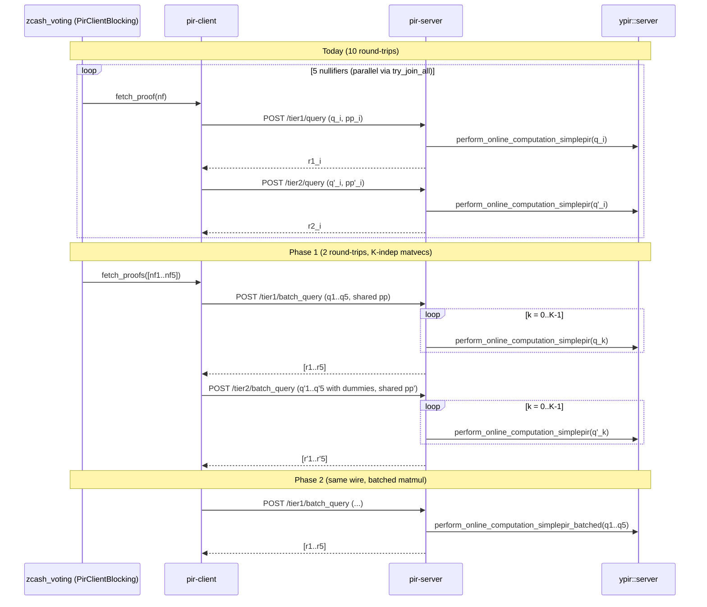

## Why not "5 ones in one query"

YPIR's SimplePIR query (see [`generate_query_simplepir`](ypir/src/client.rs) at lines 495–556 and the unit-vector encoding in [`generate_query_impl`](ypir/src/client.rs) at lines 203–310) sets exactly one position to `scale_k` in the encrypted plaintext vector. The server returns the homomorphic dot product of that vector with each DB column, so encoding 5 ones gives `Σᵢ DB[iₖ]` — the *sum* of the 5 rows, mod the plaintext modulus. For tier 1 (64 leaf records/row) and tier 2 (1024 leaf records/row), that sum mixes siblings and leaf records irrecoverably; we cannot reduce the query *count* below 5/tier without a true batch-PIR scheme.

What we *can* do:
- send 5 SimplePIR queries in **one HTTP call** per tier (Phase 1);
- have the server compute them as **one matrix–matrix product** instead of five matvecs (Phase 2), reusing the K-generic kernel that already exists at [`fast_batched_dot_product`](ypir/src/kernel.rs).

## Postmortem: shared `s` was unsound

The original Phase 1 plan shared one Regev secret and one `pack_pub_params`
across the K subqueries in a batch. That is unsafe because the SimplePIR row
query uses deterministic public randomness for the `a` term. For two uploaded
queries under the same `s`:

```
ct_1 = a * s + m_1 + e_1
ct_2 = a * s + m_2 + e_2
ct_1 - ct_2 = m_1 - m_2 + e_1 - e_2
```

The `a * s` term cancels. After applying the public scaling inverse used by
YPIR's packed row query, the server can distinguish the sparse plaintext
difference from the small error difference and cluster the queried row
positions within the batch. Across tier 1 and tier 2 this reveals the
nullifiers in the delegation.

The shipped salvage path keeps the **one HTTP request per tier** win but drops
the shared-secret bandwidth win:

- each slot now has an independent `(q_k, pp_k, seed_k)`;
- `/tier{1,2}/batch_query` still carries all K slots in one body;
- the server still performs one online computation per slot, using that slot's
  matching `pp_k`;
- Phase 2 can still replace K matvecs with a K-wide kernel because it batches
  the `q.0` vectors, not shared client secrets.

## Architecture



## Phase 0 — Baseline against production (DO THIS FIRST)

Goal: generate a one-page latency / bandwidth / server-compute baseline for the *current* code path against `https://pir.valargroup.org`, with enough samples to support percentile claims, before touching any production code. Every later phase reports a delta against this baseline.

### 0.1 Acquire production-matching nullifier set

The bench picks `nf_lo + 1` from punctured ranges to ensure the picked values exist in the server's tree (otherwise tier-1 lookups error and `try_join_all` short-circuits, killing the timing). Production snapshot is `snapshot_height = 3317500` per [token-holder-voting-config/voting-config.json](token-holder-voting-config/voting-config.json). The local sync at `vote-nullifier-pir/nullifiers.bin` is currently height 3,304,638 — close but not exact. Two options:

- **(preferred)** Re-sync to 3,317,500: `mise run sync` (or the equivalent `nf-server sync --height 3317500`) so every range in `prepare_nullifiers` exists on the production server too.
- **(fallback)** Use `pir.valargroup.org`'s exposed `/tier0` endpoint to derive valid `nf_lo+1` indices client-side (Tier 0 is plaintext — see [pir/server/src/main.rs](vote-nullifier-pir/pir/server/src/main.rs) `get_tier0` route). Add a tiny helper in [pir/test/src/main.rs](vote-nullifier-pir/pir/test/src/main.rs) that downloads tier0 and picks 5 valid leaves directly, removing the local-nullifiers prerequisite.

### 0.2 Add `pir-test bench-server` mode ([pir/test/src/main.rs](vote-nullifier-pir/pir/test/src/main.rs))

Extend the existing harness — the per-query `TierTiming` struct in [pir/client/src/lib.rs](vote-nullifier-pir/pir/client/src/lib.rs) lines 484–501 already records `gen_ms`, `rtt_ms`, `decode_ms`, `server_total_ms`, `server_compute_ms`, `server_validate_ms`, `server_decode_copy_ms`, `net_queue_ms`, `upload_to_server_ms`, `download_from_server_ms`, `upload_bytes`, `download_bytes`, so we just need an aggregation loop:

```rust
BenchServer {
    url: String,                     // https://pir.valargroup.org
    nullifiers: Option<PathBuf>,     // optional, auto-derive from /tier0 if absent
    iterations: usize,               // default 30
    batch_size: usize,               // default 5 (K)
    mode: BenchMode,                 // Parallel | Sequential | Single (K=1)
    warmup: usize,                   // default 3 iterations dropped
    json_out: Option<PathBuf>,
    seed: Option<u64>,
}
```

For each iteration, call `client.fetch_proofs(&K_random_test_values)`, capture per-note `NoteTiming`, and feed into a `hdrhistogram::Histogram` keyed by `(tier, metric)`. Emit:

- p50/p95/p99/max for: total wall-clock per batch, T1 RTT, T2 RTT, T1 server_compute, T2 server_compute, T1 net_queue, T2 net_queue
- mean per-batch upload bytes / download bytes per tier
- min/max sample sizes
- JSON output schema usable for CI gating later

### 0.3 Run baselines

Drive against both production endpoints from a low-RTT location (laptop / CI worker — record location for fair compare):

- `bench-server --url https://pir.valargroup.org   --batch-size 1 --iterations 30 --json-out k1-primary.json`
- `bench-server --url https://pir.valargroup.org   --batch-size 5 --mode parallel   --iterations 30 --json-out k5par-primary.json`
- `bench-server --url https://pir.valargroup.org   --batch-size 5 --mode sequential --iterations 30 --json-out k5seq-primary.json`
- Same triplet against `https://pir-backup.valargroup.org`.

Also tee one `RUST_LOG=pir_client=debug` run through `print_timing_table` ([pir/client/src/lib.rs](vote-nullifier-pir/pir/client/src/lib.rs) lines 521–597) so the per-note timing table is captured verbatim for the report.

### 0.4 Write up the baseline

Land the result as `vote-nullifier-pir/docs/pir-batch-bench.md` with:

- The `bench-server` invocations and observer location.
- A table of p50/p95/p99 wall-clock (ms), per-tier RTT (ms), per-tier server compute (ms), per-tier net queue (ms), per-tier upload/download (bytes), for each `(endpoint, mode, K)` cell.
- The `print_timing_table` excerpt for one representative K=5 parallel run.
- The Phase 1 / Phase 2 success criteria: Phase 1 must reduce upload bytes by ≥ (K-1)/K of the per-tier pub_params share and cut wall-clock by ≥ 1 RTT/tier at p50; Phase 2 must additionally cut tier-2 server-compute wall by ≥ 1.5×.

The same harness is reused at the end of Phase 1 and Phase 2 — same JSON schema → easy diff in the doc.

### 0.5 Acceptance

- `pir-test bench-server` runs locally without code changes outside [pir/test/src/main.rs](vote-nullifier-pir/pir/test/src/main.rs) and a small histogram dependency add.
- Baseline JSON files committed under `vote-nullifier-pir/docs/baselines/`.
- `pir-batch-bench.md` reviewed by the team; numbers are the gate for Phase 1/2 sign-off.

## Phase 0.5 — Pre-implementation experiments (de-risk Phase 1)

Goal: replace every "we expect" / "we estimate" / "we believe" in the Phase 1 spec with a measured number or a documented audit conclusion **before** any wire-format code is written. All five experiments stay on the `bench/pir-batch-phase0` branch and extend PR #65 (or land as a follow-up Phase 0.5 PR if PR #65 is already merged); none of them touch production code paths or the ypir crate.

### 0.5.1 Pack-pub-params vs. q.0 byte split — instrument the harness

Today the wire upload is one opaque `serialize_ypir_query(query.0, query.1)` blob in [pir/client/src/lib.rs](vote-nullifier-pir/pir/client/src/lib.rs) line 423. The Phase 1 bandwidth claim ("≤ K-1/K of the per-tier pp share is removed") needs the actual `query.0.len()` (pack_pub_params) vs `query.1.len()` (q.0) byte split per tier — currently inferred from defaults, not measured.

- Add two fields `upload_pp_bytes: usize` and `upload_q_bytes: usize` to `TierTiming` in [pir/client/src/lib.rs](vote-nullifier-pir/pir/client/src/lib.rs) lines 32-59.
- Populate from `query.0.len() * 8` and `query.1.len() * 8` in `ypir_query` (lines 397–590).
- Surface in the `bench-server` JSON schema (per-tier mean and per-iteration sample) under the existing `tiers[].bandwidth` block.
- Rerun **only** primary K=1 (1 invocation × 30 iterations) to capture the four numbers (T1.pp, T1.q, T2.pp, T2.q) and commit the JSON.
- Output gate: writeup gets a "Per-tier upload byte split (measured)" table; the projected Phase 1 upload of `pp + K * q` becomes a number.

### 0.5.2 YPIR API audit — can one seed drive K queries?

[ypir/src/client.rs](ypir/src/client.rs) line 641-650 (`generate_query_simplepir`) **always** generates a fresh `client_seed` via `generate_secure_random_seed()` and never accepts one as input, so calling it K times yields K independent secrets with K independent `pack_pub_params`. There are three viable code paths for Phase 1; this experiment picks one.

- **Path A — ypir patch.** Add `generate_query_simplepir_with_seed(target_row, seed)` and `generate_full_query_simplepir_with_yclient(&YClient, target_idx)` to [ypir/src/client.rs](ypir/src/client.rs); pir-client builds one `YClient::from_seed`, calls the second method K times. Cost: cross-repo patch on `ypir`, requires release coordination.
- **Path B — drop one level lower in pir-client.** Bypass `YPIRClient` and call `Client::init` + `client.generate_secret_keys_from_seed(my_seed)` + `YClient::from_seed(&mut client, &params, my_seed)` once, then `y_client.generate_full_query_simplepir(target_idx)` K times. Cost: pir-client takes a hard dependency on `spiral-rs`/internal `YClient` API surface; **only viable** if `generate_full_query_simplepir` does NOT internally re-derive `pack_pub_params` per call.
- **Path C — cache `pack_pub_params` in `YClient`.** Refactor `YClient` so `pack_pub_params` is a field computed once at construction and reused across `generate_full_query_simplepir` calls. Cost: bigger ypir refactor but cleanest API.

Audit work (read-only, one engineer, ~30 min):

1. Read `YClient::from_seed`, `generate_full_query_simplepir`, and `raw_generate_expansion_params` in [ypir/src/client.rs](ypir/src/client.rs).
2. Determine where `pack_pub_params` is computed: per-construction (B works), per-call (B requires refactor → C), or shared via a cache (B works as-is).
3. Decide A/B/C and write the verdict + rationale into the writeup (Section 0.5).
4. If Path B: write a 50-line spike in `pir-test` that builds 5 queries under one seed, serializes them, and verifies that `query.0` (pp) is byte-identical across all 5. Commit the spike test.
5. If Path A or C: scope the ypir change in a separate ypir-side issue; pir-client work continues against the spike.

### 0.5.3 Single-TLS bench mode — is the wall-clock loss contention or bandwidth?

The Phase 1 wall-clock claim ("400-700 ms p50 reduction") rests on the hypothesis that today's K=5 parallel mode is **upload-contention-bound** at the residential/CI uplink, not **per-query upload-bandwidth-bound**. If the latter, Phase 1's bandwidth reduction (1.7 MB upload vs 6.64 MB) gives most of the wall-clock win independently of contention; if the former, the win comes from removing contention itself. We need to know which.

- Add a new `--mode single-tls` to `BenchMode` in [pir/test/src/bench_server.rs](vote-nullifier-pir/pir/test/src/bench_server.rs).
- Build the `reqwest::Client` with `.http1_only()`, `.pool_max_idle_per_host(0)`, `.pool_idle_timeout(Duration::from_secs(0))` and issue the K queries **sequentially** (await per-query) so they share one TCP/TLS connection one-at-a-time. This isolates "5× the per-query bandwidth + 5× one-connection RTT" from "5× contended HTTP/2 streams".
- Rerun against primary + backup, K=5 (no need for K=1 — that's already covered).
- Output: per-tier upload p50/p95 in single-tls mode vs parallel mode in the writeup; the difference is the upper bound on the contention-only Phase 1 win.

### 0.5.4 Post-decode `s`-dependent observables audit

Phase 1's "shared `s` per batch is safe" argument is grounded in the YPIR error-oracle mitigation tests at [pir/client/src/lib.rs](vote-nullifier-pir/pir/client/src/lib.rs) lines 964, 1055, 1080, 1104, which assert that the *accept/reject* decision is `s`-independent. We need to extend that audit to everything downstream of `ypir_query` returning `Ok(decoded)`: the decoded plaintext bytes flow through `process_tier2_and_build` and into `ImtProofData` consumers. Any `s`-correlated downstream observable (Merkle path content, allocation patterns, structured logs, telemetry counters) re-opens an oracle.

- Trace from [pir/client/src/lib.rs](vote-nullifier-pir/pir/client/src/lib.rs) `fetch_proof_inner` post-decode (lines ~298-390) → `process_tier2_and_build` → `ImtProofData` consumers in `zcash_voting`. Read 3-5 files; estimate ~45 min.
- For each side-channel category, mark **safe** (decoded plaintext is uncorrelated with `s` after a successful decryption) or **flag-for-Phase-1** (requires explicit handling).
- Document the checklist in the writeup as "Post-decode side-channel surface" (Section 0.5).

### 0.5.5 Batched error-oracle regression test (failing-spec for Phase 1)

Lock the invariant **before** changing the wire path. Today's per-query `s` makes the invariant hold by independence; Phase 1 keeps the invariant under a shared `s` across K queries; this test must pass under both implementations (with the test itself unchanged).

- Mirror the existing `decryption_outcome_independent_of_secret_key` test in [pir/client/src/lib.rs](vote-nullifier-pir/pir/client/src/lib.rs) line 964-onward. Call the new test `decryption_outcome_independent_of_secret_key_batched`.
- Use the existing wiremock `TestFixture` (lines 715-755) to stand up a fake server that returns crafted responses for a 5-element batch.
- For each adversarial shape S ∈ {all-zeros, random, max-value} and each subquery position k ∈ 0..5: run `fetch_proofs(&[nf_1..nf_5])` with two distinct RNG seeds, capture the per-k `Result<ImtProofData>` outcomes, and assert that the success/failure pattern (and any `s`-independent observable from §0.5.4) matches across the two seed runs.
- Test must pass on `main` today (per-query `s` makes this trivially true). It becomes the failing-spec gate that Phase 1 must keep green.

### 0.5.6 Update the writeup

Extend [vote-nullifier-pir/docs/pir-batch-bench.md](vote-nullifier-pir/docs/pir-batch-bench.md) with a new "Pre-implementation experiments" section (Section 0.5) containing:

- Table: per-tier `pack_pub_params` vs `q.0` byte split (measured, from §0.5.1).
- Recomputed Phase 1 projected upload table using measured pp/q split (replacing the inferred numbers in the existing "Per-tier bandwidth (per query, deterministic)" table).
- §0.5.2 verdict: A vs B vs C, plus rationale and any `pir-test` spike output.
- Table: single-tls vs parallel upload p50/p95 (measured, from §0.5.3) with verdict "contention-bound" / "bandwidth-bound" / "mixed".
- §0.5.4 post-decode side-channel checklist (markdown bullets, safe vs flag-for-Phase-1).
- §0.5.5 batched-oracle test status (file path, test name, current pass/fail).
- Convert Phase 1 acceptance criteria from "≥ 1 RTT/tier wall-clock improvement at p50" (inferred) to specific numbers derived from §0.5.3 and §0.5.1.

### 0.5.7 Acceptance

- All five experiment outputs land in the writeup (or, for §0.5.5, as a green test in CI); reviewers are unblocked from approving Phase 1 without re-asking any question already answered.
- Phase 1 wire format (§1.1), Phase 1 client API path (§1.2), and Phase 1 success gates (§1.5) all have a concrete number or A/B/C choice attached.
- No production code path or `ypir` crate is modified by Phase 0.5; everything is harness, tests, audit notes, or read-only spike code in `pir-test`.

## Phase 1 — HTTP/wire batching

### 1.1 Wire format ([pir/types/src/lib.rs](vote-nullifier-pir/pir/types/src/lib.rs))

Add `serialize_ypir_batch_query` / `parse_ypir_batch_query`:

```
[8 bytes LE u64: K]
[8 bytes LE u64: pqr_byte_len]      // identical for all K queries (depends only on params)
[8 bytes LE u64: pp_byte_len]       // identical shape for all K queries
[K * (pqr_byte_len + pp_byte_len) bytes: (q_1 || pp_1) || ... || (q_K || pp_K)]
```

The `pqr` and `pp` byte lengths are fixed for a given scenario. The contents are
per-slot: every subquery has an independent `client_seed`, secret key, and
`pack_pub_params`. This preserves the HTTP batching win while avoiding
pairwise cancellation of the `a * s` term.

Response wire format:

```
[8 bytes LE u64: K][8 bytes LE u64: response_bytes_per_query][K * response_bytes_per_query bytes]
```

### 1.2 Client ([pir/client/src/lib.rs](vote-nullifier-pir/pir/client/src/lib.rs))

- Add `fn ypir_batch_query(&self, scenario, tier_name, row_idxs: &[usize], expected_row_bytes) -> Result<(Vec<Vec<u8>>, BatchTiming)>` that:
  - Generates K independent SimplePIR queries against `row_idxs` by calling the existing public `YPIRClient::generate_query_simplepir` API once per row; each slot has its own `client_seed` and `pack_pub_params`.
  - Posts to `POST /<tier>/batch_query` with the wire format above.
  - On response, splits into K slices and decrypts each with its matching `client_seed`.
- Rewrite `fetch_proofs` to:
  1. Compute `s1_k = process_tier0(nf_k)` for each k locally.
  2. One tier-1 batch query for `[s1_1..s1_K]`.
  3. For each k, on tier-1 success compute `t2_row_idx_k = s1_k * TIER1_LEAVES + s2_k`; on failure fall back to dummy idx 0 (preserving the [error-oracle mitigation](vote-nullifier-pir/pir/client/src/lib.rs) at lines 290–367 at *batch* granularity — i.e. the tier-2 batch is always sent, with dummies replacing failed-tier-1 indices, and the per-k error is propagated only after).
  4. One tier-2 batch query for `[t2_row_idx_1..t2_row_idx_K]`.
  5. Per-k call `process_tier2_and_build`, returning `Vec<ImtProofData>`.
- `fetch_proof(nf)` becomes `fetch_proofs(&[nf])[0]` (always go through the batch path; K=1 is a degenerate case).
- Generic K: implementation accepts any K up to `MAX_BATCH_K = 16`; the only currently-exercised value is 5. Add a debug log warning if K > MAX_BATCH_K and reject.

### 1.3 Server ([pir/server/src/lib.rs](vote-nullifier-pir/pir/server/src/lib.rs) + [main.rs](vote-nullifier-pir/pir/server/src/main.rs))

- Add `TierServer::answer_batch_query(query_bytes) -> Result<BatchAnswer>` that:
  - Parses the new wire format.
  - **For Phase 1**, calls `perform_online_computation_simplepir` K times, each with that slot's `pub_params` slice (no internal change to ypir).
  - Concatenates the K responses into the response wire format.
  - Reports per-batch + per-query timing in headers (`x-pir-server-total-ms`, `x-pir-server-compute-ms`, `x-pir-batch-k`, etc.).
- Add `POST /tier1/batch_query` and `POST /tier2/batch_query` routes wired through `dispatch_query`-style logic, including inflight tracking.
- Keep the legacy `/tier{1,2}/query` routes during the rollout window so older SDK builds keep working.
- Bound `K ≤ MAX_BATCH_K` server-side; reject otherwise with HTTP 400 to prevent DoS via huge K.

### 1.4 SDK call site ([zcash_voting/src/storage/operations.rs](zcash_voting/zcash_voting/src/storage/operations.rs))

No change needed — the existing `pir_client.fetch_proofs(&nullifiers)` call at lines 348–355 picks up the batched implementation transparently.

### 1.5 Tests

- `pir-client` unit test: `fetch_proofs` of 5 random in-range values returns 5 verifying `ImtProofData` against a `wiremock` server replaying real precomputed batched responses (use the existing `TestFixture` in tests at lines 715–755).
- `pir-client` unit test: error-oracle mitigation at batch granularity — corrupted tier-1 batch response must still result in a tier-2 batch POST being sent (extend the existing `tier2_query_sent_despite_tier1_decode_failure` test at line 970 to the batch route).
- `pir-server` test: 5 batched queries against an in-memory tier server decode to the same rows as 5 sequential single-query responses with independent client seeds.
- `pir-test` end-to-end: extend the harness to drive `fetch_proofs` for K∈{1,3,5,16}.
- Bench gate: re-run `pir-test bench-server --batch-size 5 --mode batched` against a *staging* PIR server with Phase 1 deployed; compare to the Phase 0 JSON. Block merge unless wall-clock at p50 drops by ≥ 1 RTT/tier vs `k5par-primary.json`.

### 1.6 Observability / rollout

- Bump `RootInfo` (or add a new `/capabilities` endpoint) with `supports_batch_query: true` so older clients can fall back gracefully.
- Add `x-pir-batch-k` response header for log analysis.
- Add a feature flag `pir_batch_query` (env var + voting service config) on the SDK side so we can disable batching server-by-server during incident response. Default off → on after a soak.

## Phase 2 — server-side batched matmul (transparent to clients)

Same wire route, faster server. Tracked already as **ZCA-239**; ZCA-256 is the remaining sub-issue.

### 2.1 Finish the K-generic kernel ([ypir/src/kernel.rs](ypir/src/kernel.rs))

- AVX-512 non-Rayon path (around line 398): loop the writeback over `for batch in 0..K` and store into the per-batch sub-slice of `c` (today only batch 0 is written).
- AVX-512 Rayon path (lines 263–395): switch from `c.par_chunks_mut(cols_per_chunk)` over the flat `K*b_cols` buffer to column-partitioned/batch-broadcast — each thread owns a column range and computes all K batches within it, so `b_t` is streamed once per chunk and reused K× in registers (this is the whole point of batching, called out explicitly in the comment at lines 295–302).
- Scalar fallback path: same writeback fix.

### 2.2 K-generic server entrypoint ([ypir/src/server.rs](ypir/src/server.rs))

- New `perform_online_computation_simplepir_batched<const K: usize>` that:
  - Asserts `first_dim_queries_packed.len() == K * params.db_rows_padded_simplepir()`.
  - Calls `fast_batched_dot_product::<K, T>` once.
  - Returns `Vec<Vec<u8>>` of length K (per-query mod-switched serialized responses).
- Or a runtime-K variant that dispatches to a small ladder of monomorphizations (`K=1,2,4,5,8,16`) to avoid blowing up code size.

### 2.3 Plug into pir-server

- `TierServer::answer_batch_query` switches from "K calls to `perform_online_computation_simplepir`" to "1 call to `perform_online_computation_simplepir_batched`" once the kernel is K-generic.
- Wire format and routes are unchanged — pure server-internal swap.
- Benchmark gate: refuse to enable Phase 2 on a tier server unless `bench-server --batch-size 5 --mode batched` shows ≥1.5× speedup in `tier2 server_compute` p50 over the Phase 1 baseline (DRAM-bound DB streaming should give roughly that on tier 2; tier 1 is small enough that Phase 1 may already saturate).

## Out of scope (callouts)

- Probabilistic batch PIR / cuckoo hashing: not worthwhile at K=5; would be the next step if delegations grow to K=20+.
- Linear-combination decoding: rejected — same number of server matvecs as plain SimplePIR, more client complexity.
- Multi-server / hint-based batch PIR: out of scope.

## Risks

- **Error-oracle mitigation must hold at batch granularity.** A naïve "abort the whole batch on tier-1 error" leaks a multi-bit oracle. Must dummy-fill failed indices and always send the tier-2 batch (Phase 1 §1.2 step 3). **De-risked by §0.5.5** — the regression test is in CI before any wire change ships.
- **Client-secret reuse across K queries.** Reusing one `client_seed` across K subqueries is unsafe: because the public `a` stream is deterministic, pairwise differences cancel `a * s` and expose sparse plaintext differences. Phase 1 now sends K independent `(q_k, pp_k, seed_k)` slots in one HTTP request, and the ypir + pir-client regression tests pin the client-to-server indistinguishability invariant.
- **Bandwidth/latency win is smaller than projected.** The 1.7 MB upload / 400-700 ms p50 numbers are inferred. **De-risked by §0.5.1 and §0.5.3** — Phase 1 success gates become measured numbers, not estimates, and the merge-or-revert decision has data backing.
- **YPIR API forces a cross-repo patch.** If §0.5.2 picks Path A or Path C, Phase 1 needs a coordinated `ypir` release. **De-risked by §0.5.2** running first; Phase 1 implementation only begins after the path is chosen.
- **Server thread pool oversubscription.** Each `perform_online_computation_simplepir` already uses Rayon. Running K of them sequentially in Phase 1 keeps Rayon's job model intact; running them in parallel via `rayon::join` would oversubscribe. Plan keeps Phase 1 sequential.
- **Body size limits.** K=16 tier-2 responses ≈ 16 × ~MB; existing `MAX_BODY_BYTES = 512 MiB` is well above that.
- **Phase 0 sample size / network jitter.** A laptop on residential WiFi will overstate net_queue. Pin the bench host (CI runner or a fixed cloud VM in the same region as the PIR server) and record it in `pir-batch-bench.md`.