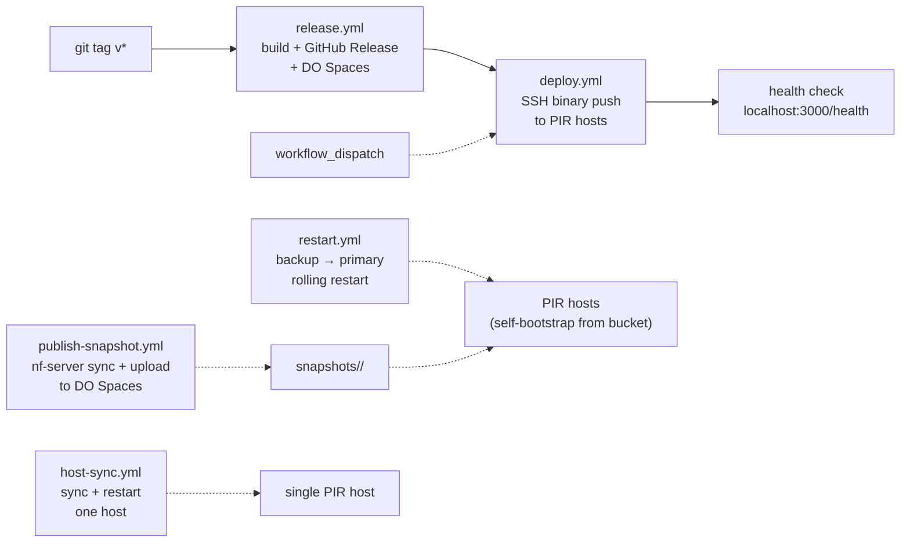

# CI setup for nf-server

This guide covers the **CI/CD-driven deployment pipeline** for `nf-server`
and the supporting infrastructure around it: GitHub Actions workflows,
repository secrets, the Sentry-side alerting wiring, and the Terraform /
cloud-init setup on the droplets.

For **standing up and operating a single host** (hardware sizing,
`start_pir.sh`, manual binary install, systemd unit, TLS reverse proxy,
`serve` / `sync` config reference, troubleshooting), see the operator
runbook: [`server-setup.md`](server-setup.md). That
runbook is the source of truth for host-side concerns; this document
does not duplicate it.

---

## Source setup (developers)

This path is for contributors and operators who want to build from source with CI/CD-driven deployment.

### Moving cached data to the deploy directory

The service uses flat binary files under a single on-disk root (`SVOTE_PIR_DATA_DIR`, default `/opt/nf-ingest/pir-data` in the shipped unit). To move them into the deploy directory:

```bash
sudo mkdir -p /opt/nf-ingest/pir-data

# Stop the service first if it is running
sudo systemctl stop nullifier-query-server || true

# Move data files (nullifiers + optional tree live next to tier files)
sudo mv /path/to/nullifiers.bin        /opt/nf-ingest/pir-data/
sudo mv /path/to/nullifiers.checkpoint /opt/nf-ingest/pir-data/
sudo mv /path/to/nullifiers.index      /opt/nf-ingest/pir-data/ 2>/dev/null || true
sudo mv /path/to/nullifiers.tree       /opt/nf-ingest/pir-data/ 2>/dev/null || true

# If upgrading from a layout with nullifiers in /opt/nf-ingest and tiers in pir-data/,
# consolidate any stragglers from the parent directory:
# sudo mv /opt/nf-ingest/nullifiers.bin /opt/nf-ingest/pir-data/ 2>/dev/null || true
# (repeat for checkpoint / index / tree as needed)

# Ensure the deploy user can write (if deploy runs as a different user)
# sudo chown -R DEPLOY_USER:DEPLOY_USER /opt/nf-ingest
```

The unit file in `docs/nullifier-query-server.service` uses `/opt/nf-ingest/pir-data` as `SVOTE_PIR_DATA_DIR` by default.

### GitHub repository secrets

The CI workflows use these repository secrets (**Settings > Secrets and variables > Actions**):

| Secret | Used by | Description |
|--------|---------|-------------|
| `PIR_PRIMARY_HOST` | `deploy.yml`, `restart.yml` | Hostname or IP of the PIR primary server. |
| `PIR_BACKUP_HOST` | `deploy.yml`, `restart.yml`, `publish-snapshot.yml` | Hostname or IP of the PIR backup server. |
| `DEPLOY_HOST` | `host-sync.yml` | Hostname or IP of the single-host sync target (often the primary). |
| `DEPLOY_USER` | all | SSH username on the remote hosts. |
| `SSH_KEY` | all | SSH private key for authentication. |
| `NF_SENTRY_DSN` | `deploy.yml` | Sentry DSN written to `/opt/nf-ingest/.env` on deploy. |
| `DO_ACCESS_KEY` | `release.yml` | DigitalOcean Spaces access key (optional; for artifact mirroring). |
| `DO_SECRET_KEY` | `release.yml` | DigitalOcean Spaces secret key (optional). |

### One-time setup on the remote host

- Create the deploy directory. Default in the workflow is `DEPLOY_PATH: /opt/nf-ingest`.
- Ensure the SSH user can write to that directory.
- Run an initial `nf-server sync` on the publisher host if you are building snapshots from chain (see `publish-snapshot.yml`).

For the host-side install itself (binary, systemd unit, env files), use
[`server-setup.md`](server-setup.md) — the CI pipeline
installs the same release artifacts it documents.

### Bumping to a new snapshot

Edit `voting-config.json`'s `snapshot_height`, run
[`publish-snapshot.yml`](https://github.com/valargroup/vote-nullifier-pir/actions/workflows/publish-snapshot.yml)
for the new height, then trigger
[`restart.yml`](https://github.com/valargroup/vote-nullifier-pir/actions/workflows/restart.yml)
to roll the fleet (backup-then-primary, with per-host
`served_height == expected_height` verification). See the
[in-repo restart runbook](restart-pir-fleet.md) for the
restart step in detail, or the [end-to-end operator runbook][runbook]
for the full bump procedure. The old per-host timer-based resync flow
was removed from `vote-infrastructure/cloud-init/pir.yaml`; use
[`host-sync.yml`](https://github.com/valargroup/vote-nullifier-pir/blob/main/.github/workflows/host-sync.yml)
if you need `nf-server sync` + restart on one machine outside the publish path.

### Changing deploy path or restart command

- **Deploy path**: Edit the `env.DEPLOY_PATH` in `.github/workflows/deploy.yml` (default `/opt/nf-ingest`).
- **Restart command**: Edit the "Install and restart" step in that workflow if you use a different service name.

### Manual runs

`deploy.yml`, `restart.yml`, `publish-snapshot.yml`, and `host-sync.yml`
all support `workflow_dispatch`, so you can trigger them from
**Actions > Run workflow** without pushing to `main`.

### Test locally

From the workspace root:

```bash
# Start the server (auto-bootstrap from data in the cloud by-default)
make serve

# Nullifiers from chain + tree checkpoint + tier export (`nf-server sync`)
make sync
```

Then check `http://localhost:3000/health` and `http://localhost:3000/root`.

[runbook]: https://valargroup.github.io/shielded-vote-book/operations/snapshot-bumps.html

---

## Snapshot-stale alerting

`nf-server` ships an in-process watchdog that fires a Sentry error
event when a host serves a snapshot older than the canonical
voting-config height for longer than
`SVOTE_PIR_STALE_THRESHOLD_SECS` (default 30 minutes). Sentry's Slack
integration then routes the event to the on-call channel.

Host-side configuration (env vars, watchdog self-disable semantics
when `SENTRY_DSN` is empty, what to look for in the startup log) is
documented in
[`server-setup.md`](server-setup.md#observability)
and the `nf-server serve` config reference in the same runbook. This
section covers only the **Sentry-side** one-time wiring that is not
visible to the host.

### Event tags (for alert filtering)

The watchdog emits events tagged for routing:

| Tag | Value |
|-----|-------|
| `alert` | `snapshot_stale` |
| `served_height` | the current served height as a string |
| `expected_height` | the canonical height as a string |
| `gap_blocks` | `expected - served` |
| `stale_seconds` | how long this host has been stale |

A host is **stale** iff `expected_height > 0 && served_height < expected_height`.
Both partial staleness (e.g. `served=3312880, expected=3312890`) and
complete staleness (`served=0, expected=3312890`, meaning no local
snapshot at all) trigger the same `alert:snapshot_stale` event.

### Sentry-side alert rule (one-time setup)

Configure the alert in Sentry (one rule per project):

1. **Settings → Integrations → Slack** — install the Sentry Slack app
   into your workspace if not already present, then **Add Workspace**
   in the project. Pick a channel like `#oncall-pir`.
2. **Alerts → Create Alert Rule** with:
   - Environment: `production`
   - When: *An issue is created*
   - If: *The issue's tags match `alert` equals `snapshot_stale`*
   - Then: *Send a Slack notification to `#oncall-pir`*
3. Save the rule. Optionally add a *resolved* notification using
   `level: info` + `message contains "snapshot height converged"` —
   the watchdog emits an info event when the gap closes after an
   alert.

### Verification

Stand up a verification fire by temporarily setting a tiny threshold
and bumping `voting-config.snapshot_height` to a value that has no
published snapshot (or tail one host's `/metrics` while you do it):

```bash
ssh root@<host> 'echo SVOTE_PIR_STALE_THRESHOLD_SECS=120 >> /etc/default/nf-server && systemctl restart nullifier-query-server'
# Wait ~3 minutes, then check the channel.
ssh root@<host> 'sed -i /SVOTE_PIR_STALE_THRESHOLD_SECS/d /etc/default/nf-server && systemctl restart nullifier-query-server'
```

A real fire shows up in Sentry as an issue with the
`alert:snapshot_stale` tag and an Error level. If you do not see the
Slack message but the issue is in Sentry, the wiring problem is on
the Sentry → Slack side, not in `nf-server`.

---

## CI/CD workflows



| Workflow | Trigger | What it does |
|----------|---------|-------------|
| [`release.yml`](https://github.com/valargroup/vote-nullifier-pir/blob/main/.github/workflows/release.yml) | `v*` tag push | Builds `nf-server` for linux/darwin x amd64/arm64, creates a GitHub Release with binaries + systemd unit, mirrors to DO Spaces, then automatically calls `deploy.yml`. |
| [`deploy.yml`](https://github.com/valargroup/vote-nullifier-pir/blob/main/.github/workflows/deploy.yml) | Called by `release.yml`, or manual `workflow_dispatch` | Downloads binary from GitHub Releases, SCPs to PIR hosts, writes `.env`, copies systemd unit, restarts service, runs readiness check on `/ready`. Supports deploying to primary, backup, or both. Hosts are rolled **serially** (`max-parallel: 1`) so the readiness gate on one host completes before the next is touched. |
| [`publish-snapshot.yml`](https://github.com/valargroup/vote-nullifier-pir/blob/main/.github/workflows/publish-snapshot.yml) | Manual `workflow_dispatch` (optional `height`, optional `include_nullifier_artifacts`) | Runs `nf-server sync` on `PIR_BACKUP_HOST` (nullifiers under `DEPLOY_PATH/pir-data`, tier artifacts staged under `/tmp` then uploaded), builds `manifest.json`, uploads `s3://vote/snapshots/<height>/{tier*.bin,pir_root.json,manifest.json}` to DO Spaces, round-trip-verifies. Set **`include_nullifier_artifacts`** to also upload `nullifiers.bin`, `nullifiers.checkpoint`, and `nullifiers.tree` into the same prefix (large); default is **false** so routine snapshot bumps stay tier-only. Replicas pick up the new snapshot via the startup self-bootstrap on next restart. |
| [`restart.yml`](https://github.com/valargroup/vote-nullifier-pir/blob/main/.github/workflows/restart.yml) | Manual `workflow_dispatch` (`targets` = `both` / `primary` / `backup`) | Rolling restart of the PIR fleet. Restarts backup first, waits for `/ready` (tier files mmapped and queries serving) and `nf_snapshot_served_height == nf_snapshot_expected_height`, then restarts primary. Primary is gated on backup succeeding so the fleet never loses both replicas at once. See [`restart-pir-fleet.md`](restart-pir-fleet.md). |
| [`host-sync.yml`](https://github.com/valargroup/vote-nullifier-pir/blob/main/.github/workflows/host-sync.yml) | Manual `workflow_dispatch` | Runs `nf-server sync` + `systemctl restart` on the host in `DEPLOY_HOST`. For fleet-wide snapshot bumps, prefer `publish-snapshot.yml` then `restart.yml`. |
| [`loadtest.yml`](https://github.com/valargroup/vote-nullifier-pir/blob/main/.github/workflows/loadtest.yml) | Manual `workflow_dispatch` | Builds `pir-test`, downloads `nullifiers.bin` from **`snapshots/<snapshot_height>/`** (per `voting-config.json`, verified against that prefix’s `manifest.json`), resolves the target PIR endpoint from the same config, and runs `pir-test load` with configurable concurrency, RPS, and duration. Uploads a JSON summary as a build artifact. Requires the snapshot to have been published with **`include_nullifier_artifacts`** at least once for the current height. |
| [`start-pir-installer-smoke.yml`](https://github.com/valargroup/vote-nullifier-pir/blob/main/.github/workflows/start-pir-installer-smoke.yml) | `pull_request` (paths), `workflow_dispatch` | Renders `start_pir.sh` like a tag release, runs it in a clean `ubuntu:24.04` container with `systemd` mocked, and asserts the binary installs and `nf-server --help` runs (validates apt bootstrap for `curl` / `ca-certificates`). |

### Removing legacy bucket-root `nullifiers.*` keys

Older notes pointed tools at the bucket origin, for example
`https://vote.fra1.digitaloceanspaces.com/nullifiers.bin`. **All in-repo
consumers now use** `snapshots/<snapshot_height>/nullifiers.bin` (with
manifest verification). After you have published the active
`snapshot_height` with **`include_nullifier_artifacts`**, delete any
stale root keys so operators are not misled by mismatched timestamps:

```bash
# Example — adjust if you used different key names.
s3cmd del s3://vote/nullifiers.bin s3://vote/nullifiers.checkpoint s3://vote/nullifiers.tree 2>/dev/null || true
```

---

## Infrastructure

PIR infrastructure (droplets, volumes, firewalls, DNS) is managed by Terraform in the
[vote-infrastructure](https://github.com/valargroup/vote-infrastructure) repo. Two
DigitalOcean droplets (primary + backup) sit in the `vote-sdk-vpc` VPC with Cloudflare
DNS records:

| Hostname | Droplet | Size |
|----------|---------|------|
| `pir-primary.<domain>` | `vote-nullifier-pir-primary` | `g-8vcpu-32gb-intel` (Premium Intel, AVX-512) |
| `pir-backup.<domain>` | `vote-nullifier-pir-backup` | `m-4vcpu-32gb-intel` (Premium Intel, AVX-512) |
| `pir.<domain>` | `pir-primary` (DNS points here) | -- |

Cloud-init templates in `vote-infrastructure/cloud-init/pir.yaml` handle first-boot
provisioning: install Caddy, mount the block volume, download `nf-server` from a
GitHub release, write `/etc/default/nf-server` with the bootstrap config
(`SVOTE_PIR_VOTING_CONFIG_URL`, `SVOTE_PIR_PRECOMPUTED_BASE_URL`), and start the service.
First-boot snapshot population and subsequent height bumps both go through
`nf-server`'s built-in self-bootstrap from the published bucket — there is no
longer a curl-based pre-stage step or a periodic `nf-resync.timer`. See the
[operator runbook][runbook] for the snapshot-bump procedure.

If that cloud-init template (or any hand-rolled unit) still passes a separate
nullifier path to `nf-server serve`, update it to a single `--pir-data-dir` (and
`SVOTE_PIR_DATA_DIR` if set) so it matches this repository’s shipped
`nullifier-query-server.service`, and move any `nullifiers.*` files under that
directory as described in [Moving cached data to the deploy directory](#moving-cached-data-to-the-deploy-directory).

[runbook]: https://valargroup.github.io/shielded-vote-book/operations/snapshot-bumps.html
