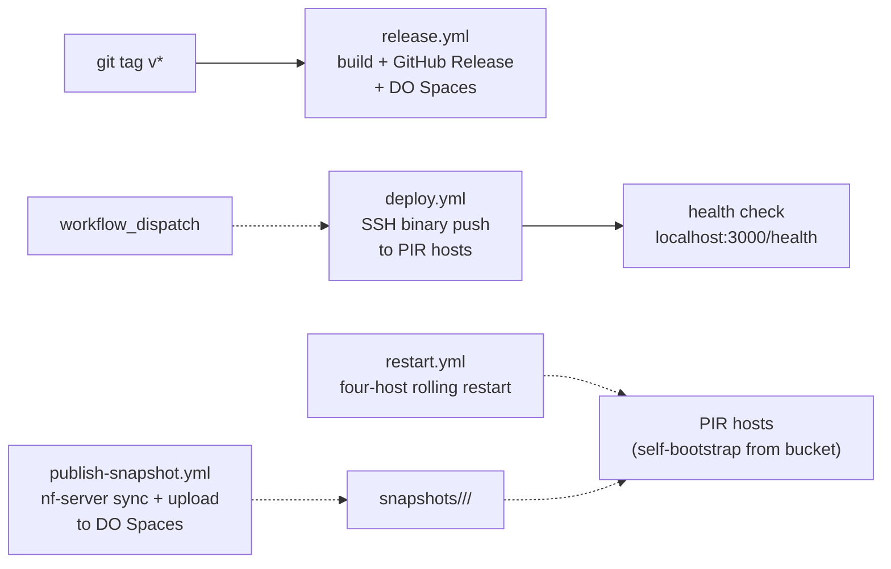

# CI setup for nf-server

This guide covers the **CI/CD-driven deployment pipeline** for `nf-server`
and the supporting infrastructure around it: GitHub Actions workflows,
repository secrets, the Sentry-side alerting wiring, and the Terraform /
cloud-init setup on the droplets.

For **standing up and operating a single host** (hardware sizing,
`start_pir.sh`, manual binary install, systemd unit, TLS reverse proxy,
`serve` / `sync` config reference, troubleshooting), see the operator
runbook: [`server-setup.md`](server-setup.md). That
runbook is the source of truth for host-side concerns; this document
does not duplicate it.

---

## Source setup (developers)

This path is for contributors and operators who want to build from source with CI/CD-driven deployment.

### Moving cached data to the deploy directory

The service uses flat binary files under a network-specific `SVOTE_PIR_DATA_DIR`.
To move Testnet data into the deploy directory (use `main` in production):

```bash
NETWORK=test
DATA_DIR="/opt/nf-ingest/pir-data/${NETWORK}"
sudo mkdir -p "$DATA_DIR"

# Stop the service first if it is running
sudo systemctl stop nullifier-query-server || true

# Move data files (nullifiers + optional tree live next to tier files)
sudo mv /path/to/nullifiers.bin          "$DATA_DIR/"
sudo mv /path/to/nullifiers.dataset.json "$DATA_DIR/"
sudo mv /path/to/nullifiers.checkpoint   "$DATA_DIR/"
sudo mv /path/to/nullifiers.index        "$DATA_DIR/" 2>/dev/null || true
sudo mv /path/to/nullifiers.tree         "$DATA_DIR/" 2>/dev/null || true

# If upgrading from a layout with nullifiers in /opt/nf-ingest and tiers in pir-data/,
# consolidate any stragglers from the parent directory:
# sudo mv /opt/nf-ingest/nullifiers.bin "$DATA_DIR/" 2>/dev/null || true
# (repeat for checkpoint / index / tree as needed)

# Ensure the deploy user can write (if deploy runs as a different user)
# sudo chown -R DEPLOY_USER:DEPLOY_USER /opt/nf-ingest
```

Move `nullifiers.dataset.json` with the raw data. Its `zcash_network` must match
the selected directory. Unlabeled and Orchard data must be rebuilt with
`SVOTE_PIR_SYNC_RESET=1`.

Set `SVOTE_ZCASH_NETWORK` and `SVOTE_PIR_DATA_DIR` in `/etc/default/nf-server`.
The shipped unit reads that file and does not hardcode a data directory.

### GitHub Environment secrets

Create GitHub Environments named `staging` and `production`. Fleet deploy and
restart workflows read secrets and variables from the selected environment
(**Settings > Environments > staging/production**):

| Secret | Used by | Description |
|--------|---------|-------------|
| `PIR_PRIMARY_HOST` | `deploy.yml`, `restart.yml` | Hostname or IP of the PIR primary server. |
| `PIR_BACKUP_HOST` | `deploy.yml`, `restart.yml` | Hostname or IP of the PIR backup server. |
| `PIR_PRIMARY_BETA_HOST` | `deploy.yml`, `restart.yml` | Hostname or IP of the PIR primary-beta replica. |
| `PIR_BACKUP_BETA_HOST` | `deploy.yml`, `restart.yml` | Hostname or IP of the PIR backup-beta replica. |
| `PIR_SNAPSHOT_PUBLISHER_HOST` | `publish-snapshot.yml` | Canonical host used to build and publish global PIR snapshot artifacts. |
| `DEPLOY_USER` | all | SSH username on the remote hosts. |
| `SSH_KEY` | all | SSH private key for authentication. |
| `NF_SENTRY_DSN` | `deploy.yml` | Sentry DSN written to `/opt/nf-ingest/.env` as `SENTRY_DSN` on deploy. |
| `SENTRY_AUTH_TOKEN` | `deploy.yml` | Optional Sentry token for `sentry-cli` deploy markers. If omitted, deploys skip marker creation. |
| `PIR_APM_SLACK_WEBHOOK_URL` | `deploy.yml` | Optional dedicated incoming webhook for PIR APM incidents in `#thv-alert`; falls back to repository `SLACK_WEBHOOK_URL`. |
| `DO_ACCESS_KEY` | `release.yml`, `publish-snapshot.yml` | DigitalOcean Spaces access key. Required for snapshot publishing and release artifact mirroring. |
| `DO_SECRET_KEY` | `release.yml`, `publish-snapshot.yml` | DigitalOcean Spaces secret key. Required for snapshot publishing and release artifact mirroring. |

Set these repository variables for global DigitalOcean Spaces publication. The
workflow defaults point at the production `shielded-vote` bucket, but setting
them explicitly avoids accidental drift if the defaults change later:

| Variable | Default | Description |
|----------|---------|-------------|
| `DO_BUCKET` | `shielded-vote` | Spaces bucket for release artifacts and `snapshots/<network>/<height>/` uploads. |
| `DO_REGION` | `nyc3` | Spaces region. Used for both s3cmd and default public URL derivation. |
| `DO_PUBLIC_BASE_URL` | `https://${DO_BUCKET}.${DO_REGION}.digitaloceanspaces.com` | Public bucket origin used by release installer URLs and publish verification. |
| `DO_PRECOMPUTED_BASE_URL` | `DO_PUBLIC_BASE_URL` | Value rendered into `start_pir.sh` as `SVOTE_PIR_PRECOMPUTED_BASE_URL`. Override only if snapshot downloads should use a different public origin. |

Set these GitHub Environment variables in both environments:

| Variable | Staging | Production | Description |
|----------|---------|------------|-------------|
| `PIR_CONFIG_URL` | `https://voting.valargroup.dev/stage/pir.json` | `https://voting.valargroup.dev/prod/pir.json` | Optional override written by deploy/restart workflows as `SVOTE_PIR_CONFIG_URL`. If unset, workflows derive the same URL from `target_environment`. |
| `VOTING_CONFIG_URL` | `https://voting.valargroup.dev/stage/static-voting-config.json` | `https://voting.valargroup.dev/prod/static-voting-config.json` | Optional legacy fallback URL written by deploy/restart workflows as `SVOTE_PIR_VOTING_CONFIG_URL`. |
| `PRECOMPUTED_BASE_URL` | `https://shielded-vote.nyc3.digitaloceanspaces.com` | `https://shielded-vote.nyc3.digitaloceanspaces.com` | Base URL used when forcing a deploy to a published snapshot height. |
| `SNAPSHOTS_BASE_URL` | `https://shielded-vote.nyc3.digitaloceanspaces.com/snapshots` | `https://shielded-vote.nyc3.digitaloceanspaces.com/snapshots` | Base URL used to validate forced snapshot heights. |
| `LWD_URLS` | Testnet post-NU6.3 endpoints | Mainnet post-NU6.3 endpoints | Required comma-separated lightwalletd gRPC URLs used for snapshot publishing and server rebuilds. |

`release.yml` and `publish-snapshot.yml` use repository-level DigitalOcean
secrets and repository variables for the shared bucket. Snapshots are separated
by network and height. If the repository
variables are absent, both workflows fall back to the production `shielded-vote`
bucket in `nyc3`. Release artifact mirroring still requires the DigitalOcean
access key and secret so `start_pir.sh`, `update_pir.sh`, binaries, and
checksums are published as part of the release.

### PIR APM sidecar

Every tagged release includes `pir-apm-linux-amd64` and
`pir-apm.service`. `deploy.yml` installs the sidecar next to `nf-server`,
writes its root-only environment file, and configures Caddy to serve it at
`/apm/` on the existing PIR hostnames:

- staging: `https://stage.pir-primary.valargroup.org/apm/` and
  `https://stage.pir-backup.valargroup.org/apm/`
- production: `https://pir-primary.valargroup.org/apm/` and
  `https://pir-backup.valargroup.org/apm/`, plus
  `https://pir-primary-beta.valargroup.org/apm/` and
  `https://pir-backup-beta.valargroup.org/apm/`

The dashboard is served without authentication and is reachable by anyone who
knows the URL. It renders only aggregate metrics and host health, never
per-request or per-user data. The sidecar itself binds only to
`127.0.0.1:3002`, and Caddy blocks the public `/metrics` route. No DNS,
firewall, or `vote-infrastructure` changes are required.

Deploys strip any `PIR_APM_BASIC_AUTH_HASH` left in `/etc/default/caddy-env`
by an earlier release, so no stale credential hash remains on the hosts. The
`PIR_APM_DASHBOARD_PASSWORD` secret is no longer read by any workflow and can
be deleted from both GitHub Environments.

The sidecar scrapes localhost and sends threshold/recovery messages directly
to `#thv-alert`. Metrics use fixed endpoint labels only; IP addresses,
request IDs, headers, and User-Agent values are never recorded.

### One-time setup on the remote host

- Create the deploy directory. Default in the workflow is `DEPLOY_PATH: /opt/nf-ingest`.
- Ensure the SSH user can write to that directory.
- Run an initial `nf-server sync` on the publisher host if you are building snapshots from chain (see `publish-snapshot.yml`).
- Configure `PIR_SNAPSHOT_PUBLISHER_HOST` in each GitHub Environment.
- Configure environment `LWD_URLS` with endpoints for that environment's network. Publishing writes to `s3://${DO_BUCKET:-shielded-vote}/snapshots/<network>/<height>/`.

For the host-side install itself (binary, systemd unit, env files), use
[`server-setup.md`](server-setup.md) — the CI pipeline
installs the same release artifacts it documents.

### Sentry project and DSNs

Use `sentry-cli` with an explicit org because local developer machines may not
have a default org configured:

```bash
sentry-cli info
sentry-cli projects list --org valar-group
```

The PIR fleet uses project `nf-server`. Keep `NF_SENTRY_DSN` scoped to the
GitHub Environment. `deploy.yml` derives the host-side `SENTRY_ENVIRONMENT`
from `target_environment` and writes `SENTRY_RELEASE` from `release_tag`; both
go into `/opt/nf-ingest/.env` next to `SENTRY_DSN`. If you rotate a DSN or need
to correct release tagging, update the selected GitHub Environment secret or
release tag, then run **Deploy nf-server** for that environment; `restart.yml`
is a pure restart and does not rewrite `/opt/nf-ingest/.env`.

After a deploy, record or verify the Sentry deploy marker with the same tag and
environment:

```bash
sentry-cli deploys new --org valar-group --project nf-server --release "$TAG" -e staging
sentry-cli deploys new --org valar-group --project nf-server --release "$TAG" -e production
```

Verification order:

1. Deploy staging first, then search Sentry for
   `project:nf-server environment:staging`.
2. If testing snapshot-stale routing, lower
   `SVOTE_PIR_STALE_THRESHOLD_SECS` on staging only and confirm the event has
   `alert=snapshot_stale` plus `environment=staging`.
3. Deploy production only after staging events are tagged correctly, then search
   for `project:nf-server environment:production`.
4. Do not run a production snapshot-stale fire drill without explicit operator
   approval because it can page the on-call channel.

### Bumping to a new snapshot

To move to a new configured snapshot height, run
[`publish-snapshot.yml`](https://github.com/valargroup/vote-nullifier-pir/actions/workflows/publish-snapshot.yml)
for the new height, update the matching environment `pir.json` in
`token-holder-voting-config` to that `snapshot_height`, then trigger
[`restart.yml`](https://github.com/valargroup/vote-nullifier-pir/actions/workflows/restart.yml)
to roll the fleet (backup-beta, backup, primary-beta, then primary, with per-host
`served_height >= expected_height` verification when a configured height exists).
See the
[in-repo restart runbook](restart-pir-fleet.md) for the
restart step in detail, or the [end-to-end operator runbook][runbook]
for the full bump procedure. The old per-host timer-based resync flow
was removed from `vote-infrastructure/cloud-init/pir.yaml`; use
[`host-sync.yml`](https://github.com/valargroup/vote-nullifier-pir/blob/main/.github/workflows/host-sync.yml)
if you need `nf-server sync` + restart on one machine outside the publish path.

For the one-time Orchard-to-Ironwood migration:

1. Configure environment `LWD_URLS` with post-NU6.3 endpoints for the selected network.
2. Install the new `nf-server` on the publisher host.
3. Publish with `reset_dataset=true` and record the resulting height.
4. Deploy the same release at that forced height in fleet rollout order.
5. Verify all four `/root` responses, then update the environment `pir.json`.

Leave `reset_dataset` false for later bumps. Published manifests use schema 2
and identify `nullifier_pool: "ironwood"` with `dataset_version: 2`.

### Changing deploy path or restart command

- **Deploy path**: Edit the `env.DEPLOY_PATH` in `.github/workflows/deploy.yml` (default `/opt/nf-ingest`).
- **Restart command**: Edit the "Install and restart" step in that workflow if you use a different service name.

### Manual runs

`deploy.yml`, `restart.yml`, `publish-snapshot.yml`, and `host-sync.yml`
all support `workflow_dispatch`, so you can trigger them from
**Actions > Run workflow** without pushing to `main`.

### Test locally

From the workspace root:

```bash
# Start the server (auto-bootstrap from data in the cloud by-default)
make serve

# Nullifiers from chain + tree checkpoint + tier export (`nf-server sync`)
make sync
```

Then check `http://localhost:3000/health` and `http://localhost:3000/root`.

[runbook]: https://valargroup.github.io/shielded-vote-book/operations/snapshot-bumps.html

---

## Snapshot-stale alerting

`nf-server` ships an in-process watchdog that fires a Sentry error
event when a host serves a snapshot older than the canonical
configured snapshot height for longer than
`SVOTE_PIR_STALE_THRESHOLD_SECS` (default 30 minutes). Sentry's Slack
integration then routes the event to the on-call channel.

Host-side configuration (env vars, watchdog self-disable semantics
when `SENTRY_DSN` is empty, what to look for in the startup log) is
documented in
[`server-setup.md`](server-setup.md#observability)
and the `nf-server serve` config reference in the same runbook. This
section covers only the **Sentry-side** one-time wiring that is not
visible to the host.

### Event tags (for alert filtering)

The watchdog emits events tagged for routing:

| Tag | Value |
|-----|-------|
| `alert` | `snapshot_stale` |
| `served_height` | the current served height as a string |
| `expected_height` | the canonical height as a string |
| `gap_blocks` | `expected - served` |
| `stale_seconds` | how long this host has been stale |

A host is **stale** iff `expected_height > 0 && served_height < expected_height`.
Both partial staleness (e.g. `served=3312880, expected=3312890`) and
complete staleness (`served=0, expected=3312890`, meaning no local
snapshot at all) trigger the same `alert:snapshot_stale` event.

### Sentry-side alert rule (one-time setup)

Configure the alert in Sentry (one rule per runtime environment):

1. **Settings → Integrations → Slack** — install the Sentry Slack app
   into your workspace if not already present, then **Add Workspace**
   in the project. Pick a channel like `#oncall-pir`.
2. **Alerts → Create Alert Rule** with:
   - Environment: `production`
   - When: *An issue is created*
   - If: *The issue's tags match `alert` equals `snapshot_stale`*
   - Then: *Send a Slack notification to `#oncall-pir`*
3. For staging, either create the same rule with Environment: `staging` routed
   to a quieter test channel, or leave it disabled unless you are testing the
   watchdog.
4. Save the rule. Optionally add a *resolved* notification using
   `level: info` + `message contains "snapshot height converged"` —
   the watchdog emits an info event when the gap closes after an
   alert.

Use `sentry-cli projects list --org valar-group` to confirm the project slug
before editing rules. If your installed `sentry-cli` does not expose an API
subcommand for rule JSON, edit the rule in the Sentry UI using the filters
above; keep the same environment names as `SENTRY_ENVIRONMENT`.

### Verification

Stand up a verification fire by temporarily setting a tiny threshold and
pointing `SVOTE_PIR_CONFIG_URL` at a staging `pir.json` whose
`snapshot_height` is higher than the host can serve (or tail one host's
`/metrics` while you do it):

```bash
ssh root@<host> 'echo SVOTE_PIR_STALE_THRESHOLD_SECS=120 >> /etc/default/nf-server && systemctl restart nullifier-query-server'
# Wait ~3 minutes, then check the channel.
ssh root@<host> 'sed -i /SVOTE_PIR_STALE_THRESHOLD_SECS/d /etc/default/nf-server && systemctl restart nullifier-query-server'
```

A real fire shows up in Sentry as an issue with the
`alert:snapshot_stale` tag and an Error level. If you do not see the
Slack message but the issue is in Sentry, the wiring problem is on
the Sentry → Slack side, not in `nf-server`.

---

## CI/CD workflows


```mermaid
flowchart LR
    tag["git tag v*"] --> release["release.yml\nbuild + GitHub Release\n+ DO Spaces"]
    manual["workflow_dispatch"] -.-> deploy["deploy.yml\nSSH binary push\nto PIR hosts"]
    deploy --> health["health check\nlocalhost:3000/health"]
    publish["publish-snapshot.yml\nnf-server sync + upload\nto DO Spaces"] -.-> bucket["snapshots/<network>/<height>/"]
    restart["restart.yml\nfour-host rolling restart"] -.-> pirHosts["PIR hosts\n(self-bootstrap from bucket)"]
    bucket -.-> pirHosts
```

| Workflow | Trigger | What it does |
|----------|---------|-------------|
| [`release.yml`](https://github.com/valargroup/vote-nullifier-pir/blob/main/.github/workflows/release.yml) | `v*` tag push | Builds `nf-server` for linux/darwin x amd64/arm64, creates a GitHub Release with binaries + systemd unit, and mirrors release artifacts to DO Spaces. It does **not** deploy to any fleet; operators run `deploy.yml` explicitly. |
| [`deploy.yml`](https://github.com/valargroup/vote-nullifier-pir/blob/main/.github/workflows/deploy.yml) | Manual `workflow_dispatch` | Downloads binary from GitHub Releases, SCPs to PIR hosts, writes `.env`, writes environment-aware `/etc/default/nf-server` PIR config defaults, copies systemd unit, restarts service, and checks `/ready`. Supports individual hosts or the full fleet. Optional `height` validates and forces a published snapshot. Full-fleet order is backup-beta, backup, primary-beta, then primary. |
| [`publish-snapshot.yml`](https://github.com/valargroup/vote-nullifier-pir/blob/main/.github/workflows/publish-snapshot.yml) | Manual `workflow_dispatch` (optional `height`, `include_nullifier_artifacts`, `reset_dataset`) | Uses environment `LWD_URLS`, syncs the selected network, and uploads under `snapshots/<network>/<height>`. `include_nullifier_artifacts` also uploads the raw artifacts. |
| [`restart.yml`](https://github.com/valargroup/vote-nullifier-pir/blob/main/.github/workflows/restart.yml) | Manual `workflow_dispatch` (individual host or `both`, optional `height`) | Rolling restart of the four-host PIR fleet in backup-beta, backup, primary-beta, primary order. Every successor is gated on `/ready` and snapshot convergence. See [`restart-pir-fleet.md`](restart-pir-fleet.md). |
| [`loadtest.yml`](https://github.com/valargroup/vote-nullifier-pir/blob/main/.github/workflows/loadtest.yml) | Manual `workflow_dispatch` | Builds `pir-test`, downloads matching network artifacts from **`snapshots/<network>/<snapshot_height>/`**, validates the target server root, and runs the load test. |
| [`start-pir-installer-smoke.yml`](https://github.com/valargroup/vote-nullifier-pir/blob/main/.github/workflows/start-pir-installer-smoke.yml) | `pull_request` (paths), `workflow_dispatch` | Renders `start_pir.sh` like a tag release, runs it in a clean `ubuntu:24.04` container with `systemd` mocked, and asserts the binary installs and `nf-server --help` runs (validates apt bootstrap for `curl` / `ca-certificates`). |

## Infrastructure

PIR infrastructure (droplets, volumes, firewalls, DNS) is managed by Terraform in the
[vote-infrastructure](https://github.com/valargroup/vote-infrastructure) repo. Four
DigitalOcean droplets form two independently load-balanceable pairs with direct
Cloudflare DNS records:

| Hostname | Droplet | Size |
|----------|---------|------|
| `pir-primary.<domain>` | `vote-nullifier-pir-primary` | `g-8vcpu-32gb-intel` (Premium Intel, AVX-512) |
| `pir-primary-beta.<domain>` | `vote-nullifier-pir-primary-beta` | `g-8vcpu-32gb-intel` (Premium Intel, AVX-512) |
| `pir-backup.<domain>` | `vote-nullifier-pir-backup` | `m-4vcpu-32gb-intel` (Premium Intel, AVX-512) |
| `pir-backup-beta.<domain>` | `vote-nullifier-pir-backup-beta` | `m-4vcpu-32gb-intel` (Premium Intel, AVX-512) |
| `pir.<domain>` | `pir-primary` (DNS points here) | -- |

Cloud-init templates in `vote-infrastructure/cloud-init/pir.yaml` handle first-boot
provisioning: install Caddy, mount the block volume, download `nf-server` from a
GitHub release, write `/etc/default/nf-server` with the bootstrap config
(`SVOTE_PIR_VOTING_CONFIG_URL`, `SVOTE_PIR_PRECOMPUTED_BASE_URL`), and start the service.
First-boot snapshot population and subsequent height bumps both go through
`nf-server`'s built-in self-bootstrap from the published bucket — there is no
longer a curl-based pre-stage step or a periodic `nf-resync.timer`. See the
[operator runbook][runbook] for the snapshot-bump procedure.

If that cloud-init template (or any hand-rolled unit) still passes a separate
nullifier path to `nf-server serve`, update it to a single `--pir-data-dir` (and
`SVOTE_PIR_DATA_DIR` if set) so it matches this repository’s shipped
`nullifier-query-server.service`, and move any `nullifiers.*` files under that
directory as described in [Moving cached data to the deploy directory](#moving-cached-data-to-the-deploy-directory).

[runbook]: https://valargroup.github.io/shielded-vote-book/operations/snapshot-bumps.html
